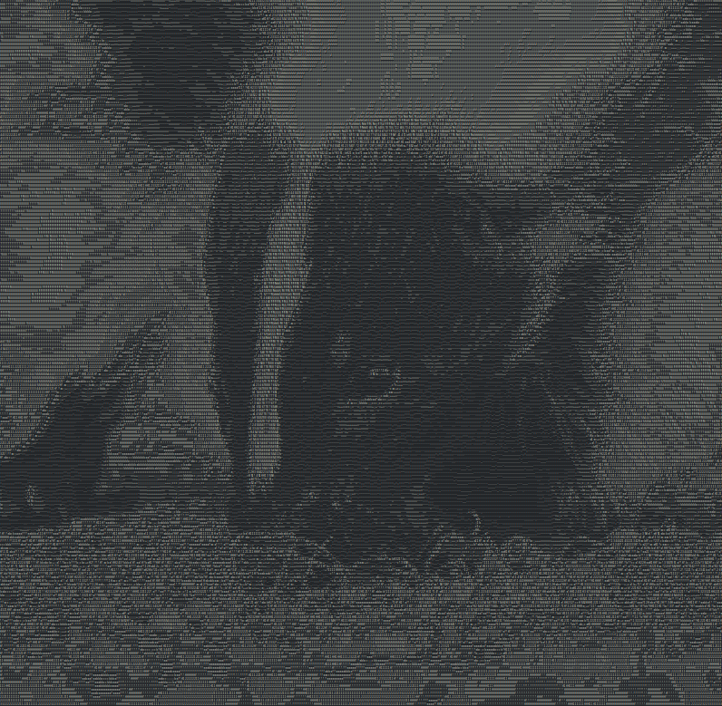
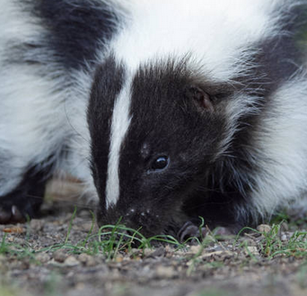
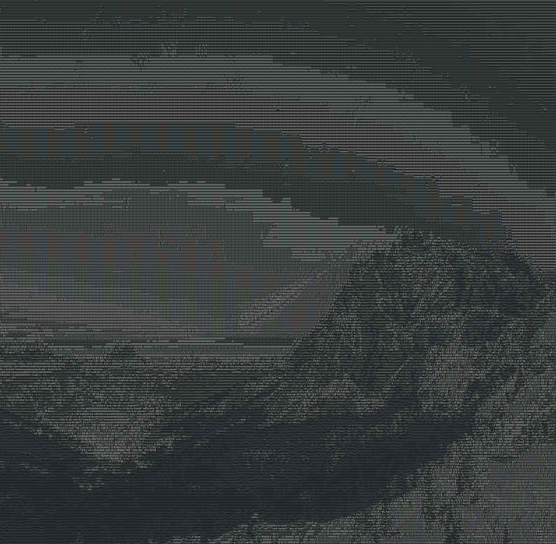
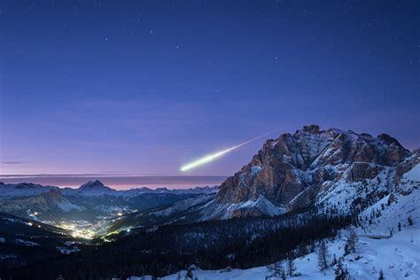
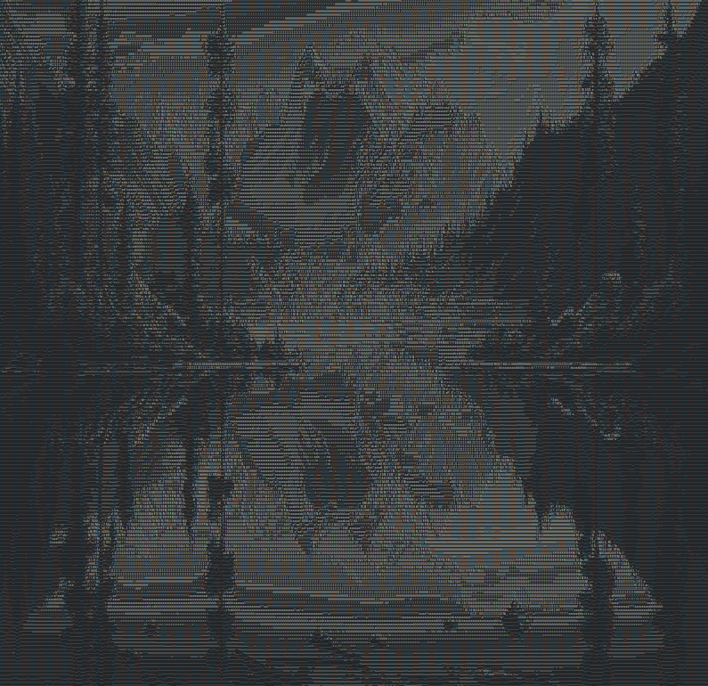
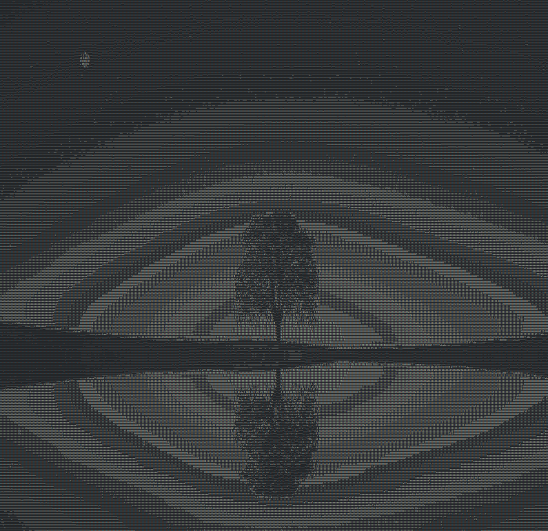
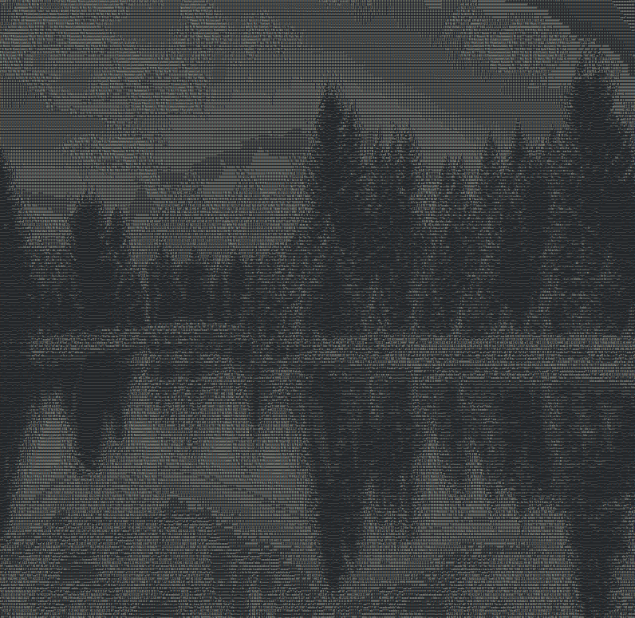

# Project Image2ascii
___
Image to ASCII is the process of converting an image into text character art.

## Usage
Example of usage:
1. `./image2ascii -p image.jpeg -s` this code returns the result in the console
2. `./image2ascii -p image.jpeg -o output.txt` this code returns the result in the file `output.txt`
3. `./image2ascii -p -H 100 -W 100 image.jpeg -o output.txt` this code changes height and width

## Program arguments
```
-h  --help\tshow help message
-p  --path\tspecifies the path to the image file that will be converted to ASCII art. [required]
-H  --height\tit determines the height of the output image and also takes an integer value. [default value 100]
-W  --width\tit specifies the width of the output image and also takes an integer value. [default value 100]
-o  --output\tdefines the path to the file where the result will be saved\n
```

## Build
Dependencies: [magick++](https://imagemagick.org/Magick++/Install.html)
<br>
To build you need: gcc or clang, cmake, ninja or make.
<br>

1. `mkdir build && cd build`
2. `cmake ..` or `cmake .. -G Ninja` if you use ninja
3. `make` or `ninja`

## Samples
1. Skunks

<br>

2. Mountains

<br>

3. Lake

<br>

4. Tree

<br>

5. Forest

<br>
